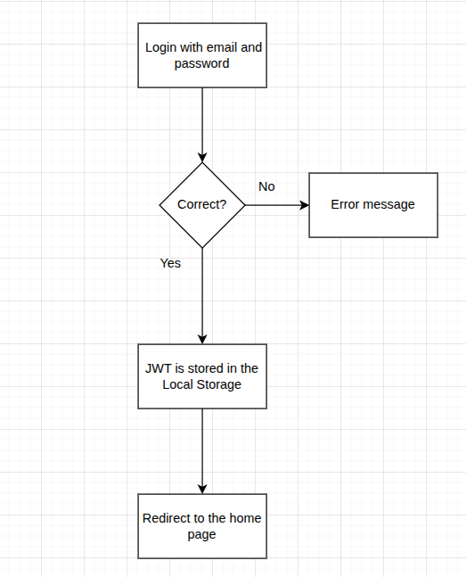

# Drivio

[Link](https://drivio-angular.netlify.app/home)

The idea of the app is to provide a platform for user to rent vehicles. Users can rent a vehicle for a specific period of time, and the app will handle the booking. For the moment there is no payment integration, but it can be added in the future.

## Features

- User registration and login
- Vehicle listing with details
- Booking system for vehicles
- User profile management
- Responsive design

## How to run the app

## NOTE

The backend server is hosted on a free hosting service (Render.com) and may take a few seconds to start up
Initialy you will see a loading screen, saying "🚀 Starting up the server, please wait a moment.."

1. Clone the repository:
   ```bash
   git clone https://github.com/your-username/drivio.git
   cd drivio
   ```
2. Install dependencies:
   ```bash
   npm install
   ```
3. Start the development server:

   ```bash
   ng serve or npm start
   ```

4. Open your browser and navigate to `http://localhost:4200`.

## Technologies Used

- **Frontend Framework:** Angular 18
- **Programming Language:** TypeScript
- **Styling:** HTML, CSS
- **Reactive Programming:** RxJS
- **Notifications:** ngx-toastr
- **Icons:** Lucide Angular
- **Linting:** ESLint, Angular ESLint
- **Code Formatting:** Prettier
- **Testing:**
  - Jasmine (Unit Testing)
  - Karma (Test Runner)
- **Build Tools:**
  - Angular CLI
  - Husky (Git Hooks)
- **Package Management:** npm

## Folder Structure

```
drivio/
├── .husky/           # Git hooks configuration
├── public/          #  Static assets (images, icons, etc.)
├── src/
│   ├── app/          # Main application code
│   │   ├── core/  #  Core features and services
│   │   ├── features/ # Feature modules
│   │   ├── layout/  # Layout components
│   │   ├── shared/ # Reusable components
│   ├── constants/      # Constants and configuration files
│   ├── environments/   # Environment-specific configurations
│   ├── styles/         # Global styles
│   ├── types/         # Type definitions

```

## Account for testing

- **Email:** alex@gmail.com
- **Password:** asdasd

## User Login Flow



## Registration Requirements

- **First Name:** Minimum 2 characters, only letters.
- **Last Name:** Minimum 2 characters, only letters.
- **Phone Number:** Must be a valid phone number format.
- **Email:** Must be a valid email format.

  _Allowed Providers: Gmail, Yahoo, Outlook, Hotmail._

- **Password:** Minimum 6 characters,
